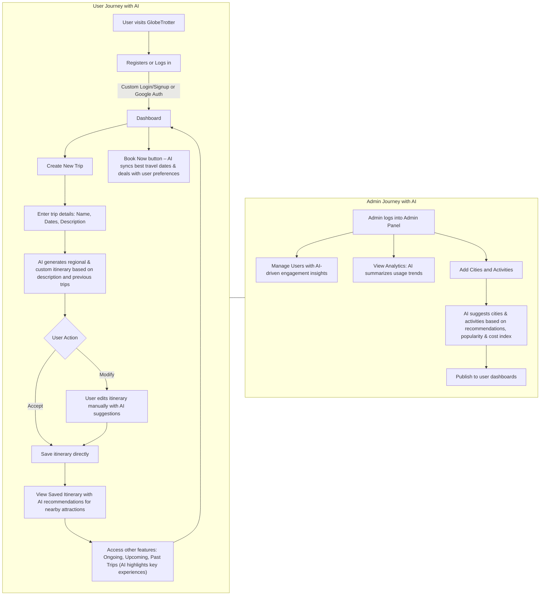

# GlobeTrotter – Empowering Personalized Travel Planning

## Introduction

**GlobeTrotter** is a personalized, intelligent, and collaborative travel planning platform designed to simplify the complexities of organizing multi-city trips. The platform enables users to explore destinations, create customized itineraries, estimate budgets, and visualize their travel plans in an intuitive and interactive way.

The aim is to make travel planning as engaging as the journey itself, allowing users to discover new places, manage costs effectively, and share their plans with friends or the public.

---

## Table of Contents

1. [Features](#features)
2. [Tech Stack](#tech-stack)
3. [System Architecture](#system-architecture)
4. [User Flow](#user-flow)
5. [Installation & Setup](#installation--setup)
6. [Usage Guide](#usage-guide)
7. [Screenshots](#screenshots)
8. [Demo Video](#demo-video)
9. [Database Schema](#database-schema)
10. [Future Enhancements](#future-enhancements)
11. [Contributing](#contributing)
12. [License](#license)

---

## Features

### 1. Authentication & User Management

* Secure login/signup system with email and password
* Google OAuth integration
* Forgot password functionality
* User profile management and preferences

### 2. Trip Creation & Management

* Create multi-city itineraries with start and end dates
* Add detailed descriptions and cover photos
* Edit, view, or delete trips

### 3. AI-Powered Itinerary Builder

* AI-generated day-wise and time-wise itineraries based on trip description
* Modify, accept, or manually add activities
* Interactive city/activity ordering

### 4. Search & Discovery

* City search with country, cost index, and popularity details
* Activity search with filters for type, cost, and duration

### 5. Budgeting & Cost Tracking

* Automatic budget estimation
* Cost breakdown by transport, stay, meals, and activities
* Visual budget charts and overbudget alerts

### 6. Visualization & Sharing

* Timeline and calendar-based trip visualization
* Public itinerary sharing with a unique link
* “Copy Trip” functionality for quick reuse

### 7. Admin Dashboard

* Manage users and platform data
* View analytics, top cities, and most popular activities
* Add cities and activities to assist users

---

## Tech Stack

| Category           | Technologies Used                                          |
| ------------------ | ---------------------------------------------------------- |
| **Frontend**       | React.js, Vite, Tailwind CSS, Material UI, Recharts        |
| **Backend**        | Node.js, Express.js                                        |
| **Database**       | MongoDB (Mongoose ODM)                                     |
| **Authentication** | JWT (JSON Web Tokens), Google OAuth 2.0                    |
| **Security**       | Bcrypt password hashing, Environment variables with dotenv |
| **File Storage**   | Cloudinary                                                 |
| **Email Service**  | Gmail SMTP                                                 |
| **Deployment**     | Vercel (Frontend), Render (Backend)                        |
| **AI Integration** | Custom AI itinerary generation pipeline                    |

---

## System Architecture

* **Client Layer:** Responsive web interface for trip planning and viewing itineraries
* **API Layer:** RESTful endpoints handling CRUD operations, AI itinerary generation, and authentication
* **Database Layer:** MongoDB storing users, trips, cities, activities, and budget data


---

## User Flow 



---

## Installation & Setup

```bash
# Clone the repository
git clone https://github.com/DebdipWritesCode/GlobeTrotter-CodeFusion.git

# Navigate to project folder
cd GlobeTrotter-CodeFusion

# Install backend dependencies
cd backend
npm install

# Install frontend dependencies
cd ../frontend
npm install

# Setup environment variables

# FRONTEND (.env)
VITE_BACKEND_URL=http://localhost:5000
VITE_GOOGLE_CLIENT_ID=your_google_client_id

# BACKEND (.env)
PORT=5000
MONGO_URI=your_mongodb_connection_string
JWT_SECRET=your_jwt_secret
REFRESH_SECRET=your_refresh_secret
GOOGLE_CLIENT_ID=your_google_client_id
GOOGLE_CLIENT_SECRET=your_google_client_secret
CLOUDINARY_CLOUD_NAME=your_cloudinary_cloud_name
CLOUDINARY_API_KEY=your_cloudinary_api_key
CLOUDINARY_API_SECRET=your_cloudinary_api_secret
GMAIL_USER=your_gmail_username
GMAIL_APP_PASSWORD=your_gmail_app_password
FRONTEND_URL=http://localhost:5173

# Run backend
cd backend
npm run dev

# Run frontend
cd ../frontend
npm run dev
```

---

## Usage Guide

1. Register or log in using email/password or Google Auth
2. Create a trip by adding name, dates, and description
3. AI generates an itinerary which you can accept or modify
4. Save your itinerary and view it in timeline or calendar format
5. Check budget breakdown and adjust activities as needed
6. Share trip publicly or keep private

---

## Screenshots

<table>
  <tr>
    <td>
      <h3>1. Login Page</h3>
      
    </td>
    <td>
      <h3>2. Dashboard</h3>
      
    </td>
    <td>
      <h3>3. AI Itinerary Builder</h3>
      
    </td>
  </tr>
  <tr>
    <td>
      <h3>4. Budget Overview</h3>
      
    </td>
    <td>
      <h3>5. Admin Panel</h3>
      
    </td>
    <td>
       <h3>6. Community Section</h3>
      
    </td>
  </tr>
  <tr>
    <td>
      <h3>7. Admin Activity Management</h3>
      
    </td>
    <td>
      <h3>8. Activity/City Search</h3>
      
    </td>
    <td>
       <h3>9. Calendar View</h3>
      
    </td>
  </tr>
</table>


   

---

## Demo Video

*(Add link here)*

---

## Database Schema

**Collections:**

* **Users** – Authentication & profile data
* **Trips** – Trip details (name, dates, description)
* **Stops** – Cities included in the trip
* **Activities** – Activities linked to stops
* **Budgets** – Estimated expenses

---

## Future Enhancements

* Real-time currency conversion
* Collaborative trip planning with multiple users
* Integration with Google Maps & Booking APIs
* Offline trip access
* AI-powered recommendations for best travel seasons

---

## Contributing

We welcome contributions.

1. Fork this repository
2. Create a feature branch
3. Commit your changes
4. Push to your fork
5. Create a pull request

---

## License

This project is licensed under the MIT License.

